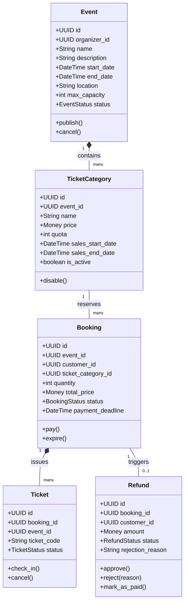

# Documentation

## 1. Ubiquitous Language Glossary

### Event Management

| Term                | Meaning                                                                |
| :------------------ | :--------------------------------------------------------------------- |
| **Event**           | An activity organized by an Event Organizer and attended by customers. |
| **Event Organizer** | A user who creates and manages events.                                 |

### Ticket Category Management

| Term                | Meaning                                                       |
| :------------------ | :------------------------------------------------------------ |
| **Ticket Category** | A type of ticket, such as Regular, VIP, or Early Bird.        |
| **Quota**           | The maximum number of tickets available in a ticket category. |
| **Sales Period**    | The period during which a ticket category can be purchased.   |

### Booking & Payment

| Term                 | Meaning                                                           |
| :------------------- | :---------------------------------------------------------------- |
| **Customer**         | A user who books and purchases tickets.                           |
| **Booking**          | A temporary reservation before payment is completed.              |
| **Money**            | A value object representing an amount and currency.               |
| **Payment Deadline** | The deadline for completing payment after a booking is created.   |
| **Pending Payment**  | A booking status indicating that payment has not been completed.  |
| **Paid**             | A booking status indicating that payment has been completed.      |
| **Expired**          | A booking status indicating that the payment deadline has passed. |

### Ticket & Check-in

| Term             | Meaning                                                                       |
| :--------------- | :---------------------------------------------------------------------------- |
| **Ticket**       | Proof of attendance generated after a booking is paid.                        |
| **Ticket Code**  | A unique code used to identify and validate a ticket.                         |
| **Check-in**     | The process of validating a ticket when a participant enters the event venue. |
| **Gate Officer** | A user who validates tickets during event check-in.                           |

### Refund Management

| Term       | Meaning                                       |
| :--------- | :-------------------------------------------- |
| **Refund** | The process of returning money to a customer. |

---

## 2. Initial Business Rules

### Event Rules

- An event cannot be created if the end date is earlier than the start date.
- An event cannot be created if the maximum capacity is less than or equal to zero.
- A newly created event must have the status `Draft`.
- An event can only be published if it has at least one active ticket category.
- An event can only be published if the total ticket quota does not exceed the maximum event capacity.
- An event with the status `Completed` cannot be cancelled.

### Ticket Category Rules

- The ticket price cannot be less than zero.
- The ticket quota must be greater than zero.
- The ticket sales period must end before or at the event start date.

### Booking Rules

- A booking can only be created for an event with the status `Published` and within an active ticket category's sales period.
- The ticket quantity must be greater than zero and must not exceed the remaining ticket quota.
- A customer cannot have more than one active booking for the same event.
- The total price is calculated from the ticket unit price multiplied by the ticket quantity (plus any service fees) and cannot be negative.

---

## 3. Initial Domain Model Draft



## 4. Project Structure

\```
app/
├── api/ # HTTP layer (routes, schemas, middleware)
├── core/ # Config, dependencies, shared utilities
├── domain/ # Entities & repository interfaces (no framework)
├── infrastructure/ # DB models, repository implementations
├── usecases/ # Application business logic
└── tests/ # Unit & integration tests
\```

## 5. Layer Responsibilities

- **domain** — pure Python, zero external dependency
- **usecases** — orchestrate domain logic, framework-agnostic
- **infrastructure** — SQLAlchemy models, concrete repo implementations
- **api** — FastAPI routes, Pydantic schemas, middleware
